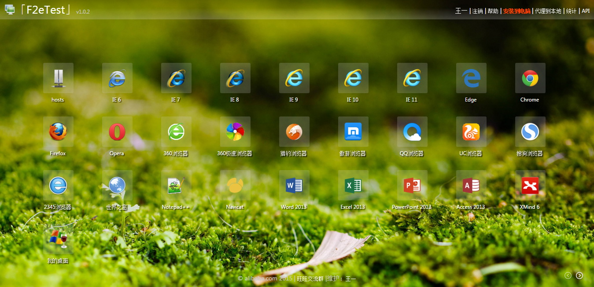

F2etest
===================

F2etest是一个面向前端、测试、产品等岗位的多浏览器兼容性测试整体解决方案。

注：F2e test = Front to End Test = 前端测试

在之前，我们一般有三种解决方案：

1. 本机安装大量的虚拟机，一个浏览器一个虚拟机，优点：真实，缺点：消耗硬盘资源，消耗CPU资源，打开慢，无法同时打开多个虚拟机
2. 使用IeTester等模拟软件，优点：体积小，资源消耗小，缺点：不真实，很多特性不能代表真实浏览器
3. 公用机器提供多种浏览器，优点：不需要本地安装，不消耗本机资源，缺点：资源利用率低，整体资源消耗非常恐怖

现在，有了F2etest，一台普通的4核CPU的服务器，我们就可以提供给20人以上同时使用。

在这之前我们需要20台机器，相比之下，至少10倍的硬件利用率提升。

再加上我们平时做多浏览器测试时，并不是满负荷工作。经常是测试一会，开发一会，或者是忙点别的事，因此理论并发能力至少可以再乘2，就是说一台4核服务器，理论上跑40人同时在线，非常轻松。

但是在此之前，如果我们是单人虚拟机模式的话，当你没在测试时，CPU、内存、硬盘，全部都是处在浪费状态。

相比之前的方案，我们有以下优势：

1. 10倍以上硬件利用率，降低企业运营成本
2. 非常棒的用户体验，极大的提高测试效率
3. 真实浏览器环境，还原真实测试场景

在这个解决方案中，我们使用了以下技术：

1. Guacamole: 开源的HTML5远程解决方案
2. Windows Server: Server版Windows，最大化复用机器资源
3. hostsShare: 跨浏览器，跨服务器的hosts共享

成功案例
===================

如果您使用了我们的解决方案，请联系我们添加在此处。

产品截图
===================

安全风险警示(非常重要)
==================

由于本系统基于Windows Server体系搭建，因此系统的安全性完全取决于部署人的安全部署能力。

如果您希望部署本系统，请确保以下几点：

1. 严禁将本系统部署在公网环境，仅可部署在内网环境中使用，作为内部测试用途
2. 请将Windows Server服务端升级到最新版本及补丁，以保证没有出现安全漏洞
3. 请将User用户之间做到完全隔离，仅提供User用户文件的访问权限，别的任何权限请勿多余授权
4. 请将f2etest-client仅设置为管理员拥有权限，防止API接口被恶意访问

安装
===================

1. 安装nodejs

    安装请访问官网：[https://nodejs.org/](https://nodejs.org/)，如果已安装好，请略过。

2. 下载f2etest代码

        git clone https://github.com/alibaba/f2etest.git

    clone后，会发现以下几个目录：

    1. f2etest-guacamole: 这是我们定制过的开源版本，方便f2etest进行调用
    2. f2etest-web: f2etest的WEB站点，用来提供f2etest服务
    3. f2etest-client: f2etest的执行机客户端站点，主要提供API给f2etest-web使用
    4. hostsshare-server: 实现跨浏览器跨系统的hosts服务器
    5. hostsShare-client: 安装在f2etest远程环境中的客户端，用来修改hostsShare上的hosts绑定

    下面会分别针对以上5个组件，会有针对性的安装教程。

    我们建议将1，2，4组件安装在同一台Linux服务器上，建议使用CentOs系统。

3. 安装f2etest-guacamole

    f2etest-guacamole是定制版本的guacamole，安装方法请查看：[Install Guacamole](./f2etest-guacamole/Install.md)

4. 安装hostsShare-server

    hostsShare是为了实现跨浏览器的hosts共享，一次修改，所有浏览器同时生效。

    由于我们使用的是Windows Server操作系统，并且基于多用户实现的机器资源复用，存在一个严重的缺陷。

    那就是hosts是系统级共享的，任何一个用户修改hosts文件，都会影响所有别的用户。

    因此hostsShare正是为了解决这个问题而开发，同时也让hosts实现了跨浏览器跨服务器成为现实。

    安装方法：

        cd hostsshare-server
        npm install
        node app

    启动成功后，会发现shostsShare默认工作在：4000端口号

    小建议：

    1. 建议使用pm2或forever等组件实现系统开机自动运行。

5. 安装mysql

    安装mysql: [https://www.mysql.com/](https://www.mysql.com/)，如果已安装好，请略过安装步骤。

    新建库：f2etest

    初始化表结构：f2etest-web/f2etest.sql

6. 配置f2etest-web

    初始化f2etest-web

        cd f2etest-web
        npm install

    修改conf/site.json：

    1. port: 站点监听端口号
    2. name: 站点名称，修改为自己站点名称
    3. about: 站点介绍，显示在网页title后面，修改为自己的站点介绍
    4. icon: 站点icon，默认不需要修改
    5. dbHost: 数据库连接信息，修改为mysql服务器IP地址
    6. dbUser: 同上
    7. dbPass: 同上
    8. dbTable: 同上
    9. clientApiKey: f2etest远程桌面客户端的ApiKey，正确的ApiKey才能访问远程的API，用来创建当前用户的账号，请更改为随机值，并保持和f2etest-client中的值一致
    10. guacamoleApi: guacamole的API，请修改为上面第3步安装完成的API
    11. footer: 根据需要修改
    12. statNav: 如果需要自行扩展统计页面，根据需要修改

    修改conf/server.json：

    > 这里的id必需要与f2etest-guacamole中的名字保持一致

    > 2003系统不支持remoteApp，2008以上Server系统支持

    修改conf/app.json：

    > 这里的server必需为server.json中已配置的id。program为可选参数，如果不填则直接连接桌面。

    修改`sso.js`：

    > 由于f2etest系统要求必需是登录用户才能访问，因此必需要对接SSO系统才能工作。

    > 请参考现有的`sso.js`文件进行修改，对接到您公司内部SSO系统。

    启动f2etest-web服务：

        node dispatch.js

    启动成功后，可以发现WEB服务默认工作在：3000端口号

    小建议：

    1. 为了方便用户使用，建议安装nginx等软件做反向代理，将端口号隐藏掉。
    2. 建议使用pm2或forever等组件实现系统开机自动运行。

7. 安装windows server机群

    * 1号机：Server 2003: IE6
    * 2号机：Server 2003: IE7
    * 3号机：Server 2008: IE8
    * 4号机：Server 2008: IE9
    * 5号机：Server 2008: IE10
    * 6号机：Server 2008: IE11

    将来如果出现IE12，可以即时增加新的服务器，用来部署新浏览器或软件。

    由于Server 2008可安装的最低IE版本是8，因此IE6和IE7只能安装在Server 2003系统中。

    安装软件及配置：

    1. 远程桌面会话主机：授权模式请选择按用户，会话请选择5分钟自动结束，空闲会话不允许超过6小时，颜色限制最大24位色
    2. 远程桌面授权：必需要进行正确激活并安装授权，安装时请选择企业授权，并按用户授权
    3. IIS：用来部署f2etest-client，由于我们的脚本使用asp编写，因此请安装asp相关支持组件
    4. 设置当前主机每天凌晨自动重启：防止开机久了，系统出现不稳定
    5. 用户组配置：请将Authenticated Users添加到Remote Desktop Users，允许普通用户可以登录远程
    6. 安装curl: 将curl的路径添加到PATH路径中，以供APP快捷方式调用
    7. 配置Remote App：如果是2008操作系统，需要将被远程的程序添加到Remote App，否则无法远程，添加快捷方式时请选择：允许任何命令行参数
    8. 安装周边软件：输入法，Flash等

    提示及注意事项：

    1. chrome由于和远程桌面有点小冲突，必需安装在2003操作系统中
    2. 使用频率比较低的浏览器，建议硬件配置可以适当降低
    3. 2008如果默认安装的是IE10浏览器，可以从安装补丁上卸载，从而降级到IE8
    4. 建议在任务计划程序中添加每周磁盘碎片整理，以保持最高工作性能

    IE浏览器安全级别低解决方案：

    1. 以桌面模式连接一个User用户
    2. 按照需要自由配置IE
    3. 打开`regedit`，导出`HKEY_CURRENT_USER\Software\Microsoft\Windows\CurrentVersion\Internet Settings\`为`c:\ie.reg`
    4. 切换为`administrator`用户
    5. 用文本软件打开`c:\ie.reg`，替换`HKEY_CURRENT_USER`为`HKEY_Users\Default`
    6. 打开`regedit`，注册表编辑器中选择节点：`HKEY_USERS`，文件菜单->`加载配置单元`，选择`C:\Users\Default\NTUser.dat`，项名称输入：`Default`
    7. 双击`c:\ie.reg`导入注册表
    8. 在注册表编辑器中选择刚才加载的配置单元：`Default`，文件菜单->`卸载配置单元`，并确认上载

    如何在每台服务器全局添加可信的根证书：

    1. 命令行打开`mmc`
    2. 菜单->`添加/删除管理单元`, 并选择：`证书`
    3. 下一步选择：`计算机帐户`，再点击下一步
    4. 在`受信任的根证书颁发机构`的`证书`栏目中添加CA即可

8. 部署f2etest-client

    每台Server服务器上都需要部署f2etest-client，实现以下两个功能：

    1. 提供API给f2etest-web调用，用来初始化用户账号
    2. 远程桌面连接时，需要打开指定的浏览器或软件，并统计相应软件的使用次数

    bat文件中需要修改两处地方：

    1. 代理服务器pac地址：修改为hostsShare服务所在的Ip地址
    2. 最后一行修改为当前服务的部署域名，用来统计用户的应用使用情况

    由于需要在当前系统中添加新用户，f2etest-web站点必需设置为administrator权限，否则无法工作

    修改setuser.asp中的apiKey，保持和f2etest-web中一致。

    2008中必需要安装Remote App，并且要在Remote App的设置中：允许任何命令行参数。

    重要安全说明：f2etest-client的www目录必需要设置为仅管理员有权限，否则任何人都可以查看到setuser.asp中的apiKey，会有严重的安全风险

9. 安装hostsShare-client

    hostsShare-client基于node-webkit开发，默认已经提供了一个编译版本在build目录中，可以直接部署使用。

    建议选择IE11所在机器上部署hostsShare-client。

    hostsShare-client的bat在f2etest-client中的app中：hostsshare.bat

使用
===================

1. WEB方式
    
    我们基于guacamole实现WEB方式的使用，没有任何学习成本。

    详细教程请参考f2etest-web中的帮助信息

2. 桌面方式

    桌面方式基于TSWF Schema协议实现的分发，目前Windows和MAC下都有完美的协议实现软件。

    Win7天然就支持远程TSWF分发技术，Mac下仅需安装[Microsoft Remote Desktop](https://itunes.apple.com/us/app/microsoft-remote-desktop/id715768417)，也可完美支持TSWF，注意此软件需要使用英文市场下的id才能安装。

    无论是Win7还是Mac，目前都已经完美支持Remote APP技术，实现远程应用本地化的完美体验。

    相比较之下，由于桌面方式属于直连，性能上会更加理想，因此我们建议用户使用桌面方式。

感谢
===================

* Guacamole: [http://guac-dev.org/](http://guac-dev.org/)
* Nodejs: [http://nodejs.org/](http://nodejs.org/)